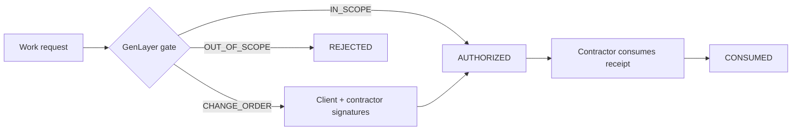

# ScopeLock

```text
SIGNED LINE: analytics dashboard
NEW REQUEST: real-time collaboration everywhere
QUESTION: included work, change order, or outside the fence?
```

ScopeLock turns that question into a reusable GenLayer authorization receipt.

[Live Bradbury contract](https://explorer-bradbury.genlayer.com/address/0x2247105dcE242fDE249e0b994245440ab57C7796) | [deployment receipt](https://explorer-bradbury.genlayer.com/tx/0xee0d08958c46ea1f9dbd9b902371a3256a4c2dacac049b38891688ab08ece513)

## The red line

Projects rarely fail because nobody wrote a scope. They fail because later requests are close enough to sound included and large enough to change the deal.

ScopeLock stores four things before work begins:

```text
CLIENT WALLET --------------+
CONTRACTOR WALLET ----------+
SIGNED SCOPE ---------------+-- immutable project baseline
DELIVERABLES + EXCLUSIONS --+
```

Every request gets a unique nonce and one of three gates:

### Green line - `IN_SCOPE`

Clearly required by the signed scope or deliverables, with no exclusion conflict. The contract issues an authorization immediately and caps cost, time, and risk impacts at 33.

### Amber line - `CHANGE_ORDER`

Related to the project but materially expands its obligations. No authority exists until client **and** contractor sign the amendment on-chain.

### Red line - `OUT_OF_SCOPE`

Explicitly excluded, unrelated, forbidden, contradictory, or impossible. This gate can never produce authority. An explicit exclusion always wins over superficial project similarity.

That last rule exists because the first live version exposed a genuine ambiguity: "build native mobile apps" was related to a dashboard, but mobile apps were explicitly excluded. Validators split between amber and red. The taxonomy was tightened, the contract was redeployed, and the corrected flow was rerun from zero. The failed attempt is not hidden; the final deployment is the one linked above.

## One authorization, used once



Authorization is checked against current project state every time. Canceling the project invalidates outstanding receipts. The contractor alone can consume one, and consumption is irreversible.

## Field test: collaboration module

The signed baseline required dashboard views, filters, CSV export, tests, and documentation. It did not include real-time annotations, presence, or comment resolution.

The corrected contract classified that expansion as `CHANGE_ORDER` with impacts of cost 60, time 50, and risk 40. The client signed. The contractor signed from a different wallet. Only then did the receipt become active, and the contractor consumed it exactly once.

[Create project](https://explorer-bradbury.genlayer.com/tx/0x2a53eb8025114caa9fa74d360629ff1323d2c39df9a0137b747ad6158bd28b01) -> [contractor accepts baseline](https://explorer-bradbury.genlayer.com/tx/0xfe06c37d8f29154bce7ea11127b0c0922df5cc27f78ede62f04811605d91c201) -> [validators issue change order](https://explorer-bradbury.genlayer.com/tx/0x4273c0ae144c6b6197d1a591c016a6379a329230304ea7070120ca5b3769e994) -> [client signs](https://explorer-bradbury.genlayer.com/tx/0x8161e28dc6fd39dded2ee7ee2a91643bc812eda258c9462e004a560b7b9bdb96) -> [contractor signs](https://explorer-bradbury.genlayer.com/tx/0x9f86d287f2d19a78bd75ca25faf4bd6699d7b3771aec536a77bdefff0479c683) -> [receipt consumed](https://explorer-bradbury.genlayer.com/tx/0x3cc826c3a101e05b0211bfb22ee264e782fdec8fe321d53976d885a91144fd33)

The exact receipt set lives in [`verification.json`](verification.json).

## Why consensus is narrow

Validators do not agree on generated prose. They independently compare the request with the same immutable baseline and must match:

- the canonical gate exactly;
- cost impact within 15;
- time impact within 15;
- risk impact within 15.

Only those fields drive authorization state. Rationale and amendment text remain explanatory. Wallet roles, replay prevention, signature thresholds, cancellation, and single-use consumption are ordinary deterministic checks.

## Contract surface

```python
create_project(contractor, title, scope, deliverables, exclusions)
accept_project(project_id)
request_change(project_id, request_id, description, reason)
approve_change_order(change_id)
consume_authorization(change_id)
cancel_project(project_id)
```

Views: `get_project`, `get_change`, `is_authorized`, `list_changes`, `get_stats`.

## Run the boundary checks

```bash
python -m pytest -q            # 5 contract tests
python scripts/deploy.py       # Bradbury deployment
python scripts/verify_live.py  # six accepted two-wallet transactions
```

The test suite covers wallet binding, included-work receipts, bilateral amendments, permanent rejection, replay attacks, foreign callers, double consumption, and cancellation invalidation.

The shared `.env` expects `GENLAYER_PRIVATE_KEY` and a separately funded `GENLAYER_SECONDARY_PRIVATE_KEY` for the counterparty.

## Bench contents

```text
contracts/contract.py    semantic gate + receipt state machine
tests/test_contract.py   scope boundary and authorization tests
scripts/verify_live.py   reproducible bilateral transaction trail
deployment.json          current Bradbury address
verification.json        accepted lifecycle hashes
```

ScopeLock is MIT licensed. It moves no funds; it produces authorization that agents, contracts, and human workflows can verify and consume.
